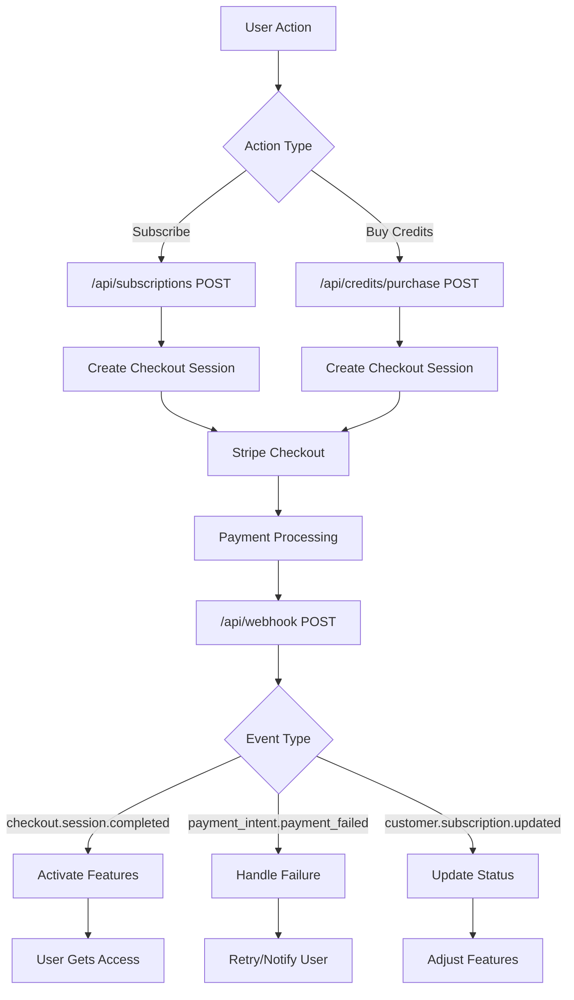
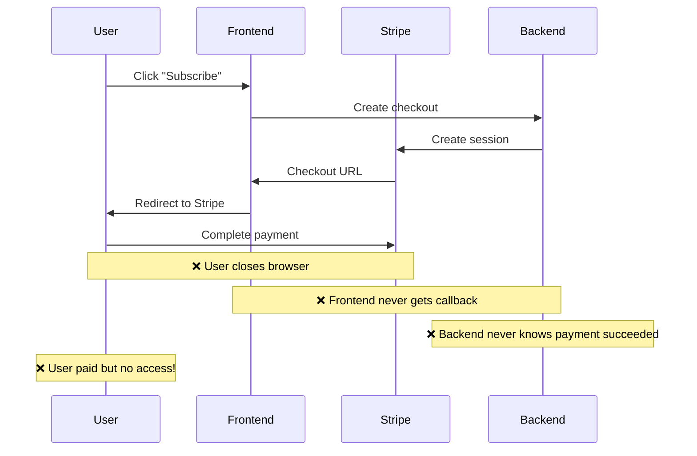
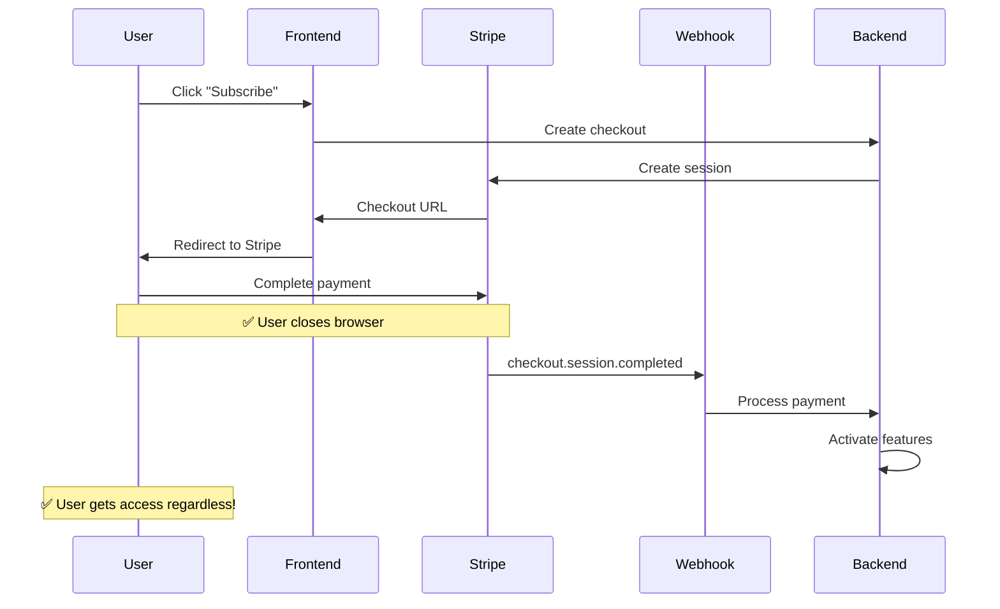
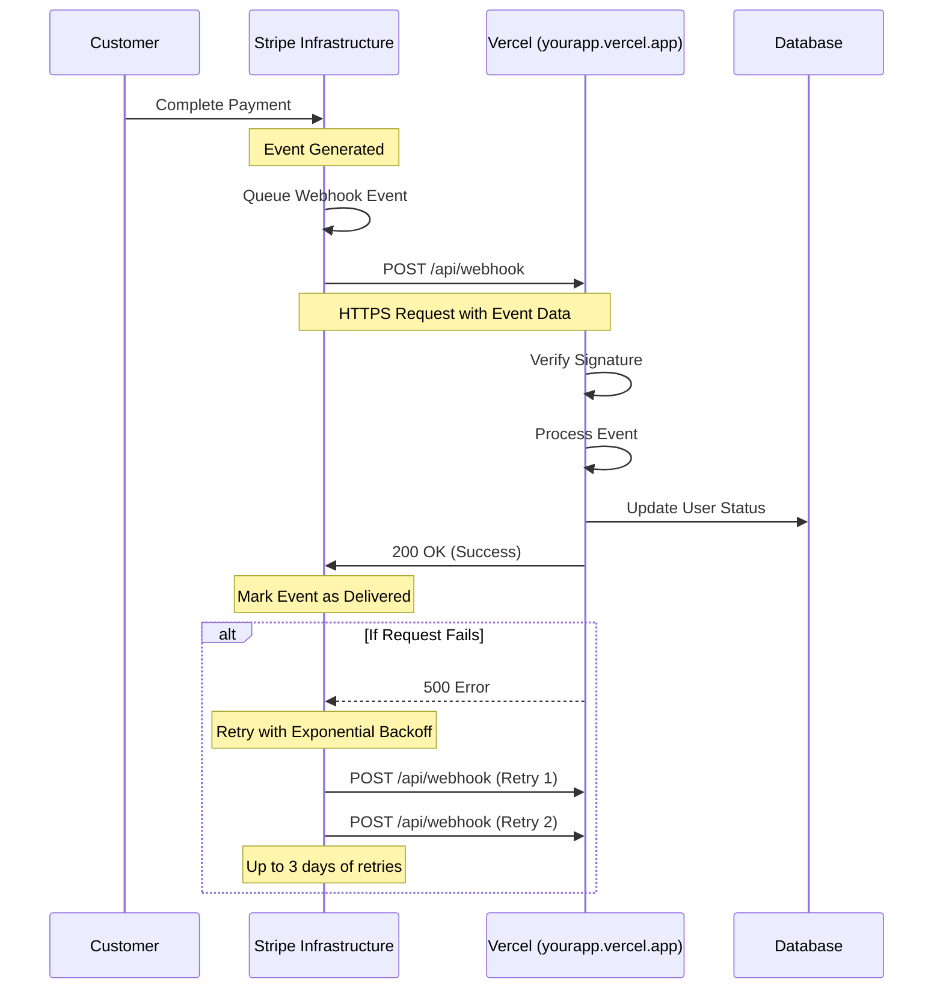

# 🚀 Stripe API Architecture & Implementation

## 📋 **What We've Accomplished**

We've built a comprehensive, production-ready Stripe integration that handles:
- ✅ **Subscription Management** (monthly, half-year, yearly plans)
- ✅ **Credit Purchases** (one-time payments with plan-based discounts)
- ✅ **Webhook Event Handling** (payment confirmations, failures, status changes)
- ✅ **Enhanced Error Handling** (specific Stripe error types with proper HTTP codes)
- ✅ **Customer Deduplication** (prevents duplicate customer records)
- ✅ **Idempotency Protection** (prevents duplicate charges on retries)

---

## 🏗️ **Current API Architecture**

### **Core APIs:**

| Endpoint | Purpose | Method | Features |
|----------|---------|--------|----------|
| `/api/subscriptions/` | Subscription lifecycle | `POST/PATCH/DELETE/PUT` | Create, update, cancel, resume |
| `/api/credits/purchase.ts` | Credit purchases | `POST/GET/PATCH` | Buy credits, list packages, calculate pricing |
| `/api/webhook/` | Event handling | `POST` | Payment confirmations, failures, status changes |

### **API Flow Diagram:**



---

## 🔄 **Why Webhooks Are Essential**

### **The Problem Without Webhooks:**



### **The Solution With Webhooks:**



---

## 🌐 **Stripe-Vercel Webhook Architecture**

### **Webhook Registration Process:**

#### **1. Initial Setup (One-Time Per Environment):**
```typescript
// Run setup script to register webhook with Stripe
await stripe.webhookEndpoints.create({
  url: `${process.env.APP_URL}/api/webhook`,  // Vercel URL
  enabled_events: [
    'checkout.session.completed',
    'customer.subscription.updated',
    // ... other events
  ]
});

// Stripe stores: "Send events to https://yourapp.vercel.app/api/webhook"
```

#### **2. Runtime Event Flow:**


### **Deployment Considerations:**

#### **Production vs Preview Deployments:**
```bash
# 1. Development/Staging (Test Mode)
APP_URL=https://staging.yourapp.com
STRIPE_SECRET_KEY=sk_test_...
npm run setup-stripe
# Creates: Test products + Test webhook

# 2. Production (Live Mode)  
APP_URL=https://yourapp.com
STRIPE_SECRET_KEY=sk_live_...
npm run setup-stripe
# Creates: Live products + Live webhook
```
### **Webhook Persistence & Reliability:**

#### **Stripe's Delivery Guarantees:**
```typescript
// Stripe Webhook Behavior:
✅ Webhooks survive Vercel redeployments automatically
✅ Events are queued and retried for up to 3 days
✅ Exponential backoff prevents overwhelming your server
✅ Duplicate event protection via idempotency
✅ Signature verification prevents spoofed requests

// Your Vercel App Responsibilities:
✅ Return 200 OK within 30 seconds for successful processing
✅ Return 4xx/5xx for failures that should be retried
✅ Verify webhook signatures for security
✅ Handle duplicate events gracefully (idempotency)
```

### **Webhook Security on Vercel:**

```typescript
// Signature Verification Process:
export async function POST(request: NextRequest) {
  const body = await request.text();
  const signature = request.headers.get('stripe-signature');
  
  try {
    // Verify this request actually came from Stripe
    const event = stripe.webhooks.constructEvent(
      body,
      signature,
      process.env.STRIPE_WEBHOOK_SECRET // Set in Vercel environment
    );
    
    // Process verified event...
  } catch (error) {
    // Invalid signature - reject request
    return NextResponse.json({ error: 'Invalid signature' }, { status: 400 });
  }
}
```

### **Monitoring & Debugging:**

#### **Vercel Logs Integration:**
```typescript
// Webhook events appear in Vercel Function Logs
console.log('Webhook received:', event.type);
console.log('Processing for user:', event.data.object.metadata?.userId);

// View logs: Vercel Dashboard → Functions → View Function Logs
```

#### **Stripe Dashboard Monitoring:**
```typescript
// Stripe Dashboard → Webhooks → Your Endpoint
✅ Delivery attempts and success rates
✅ Recent event deliveries and responses  
✅ Failed deliveries with error details
✅ Test webhook functionality
```

---

## 🎯 **Webhook Event Handling**

### **Events We Handle:**

| Event Type | Purpose | Action |
|------------|---------|--------|
| `checkout.session.completed` | Payment succeeded | Activate subscription/add credits |
| `customer.subscription.updated` | Plan changed | Update user's plan status |
| `customer.subscription.deleted` | Subscription canceled | Downgrade to free |
| `payment_intent.payment_failed` | Payment failed | Notify user, retry logic |
| `invoice.payment_failed` | Recurring payment failed | Dunning management |

### **Real-World Scenarios:**

#### **Scenario 1: Mobile App Payment**
```
User pays in mobile app → App killed by OS → Webhook still fires → User gets access
```

#### **Scenario 2: Network Issues**
```
Payment succeeds → Network drops → Frontend never notified → Webhook ensures access
```

#### **Scenario 3: Subscription Management**
```
Card expires → Auto-renewal fails → Webhook notifies → User contacted → Access maintained
```

#### **Scenario 4: Dispute/Chargeback**
```
Bank reverses payment → Stripe cancels subscription → Webhook fires → Access revoked
```

---

## 🔧 **Environment Variables Required**

```bash
# Stripe Configuration
STRIPE_SECRET_KEY=sk_test_...
STRIPE_WEBHOOK_SECRET=whsec_...

# Plan Price IDs
STRIPE_PRICE_PRO_MONTHLY=price_...
STRIPE_PRICE_PRO_HALF_YEAR=price_...
STRIPE_PRICE_PRO_YEARLY=price_...
STRIPE_PRICE_PLUS_MONTHLY=price_...
# ... (similar for plus and astro plans)

# Credit Package Price IDs
STRIPE_PRICE_CREDIT_500_BASE=price_...
STRIPE_PRICE_CREDIT_500_PRO=price_...
# ... (similar for 2000 and 3500 credit packages)

# Application URLs
NEXT_PUBLIC_WEBSITE_A_URL=https://yourdomain.com
```

---

## 🚦 **Next Steps & TODOs**

### **Database Integration**
```typescript
// Currently commented out - needs implementation:
await database.user.update({
  where: { id: userId },
  data: {
    subscriptionId: session.subscription,
    subscriptionStatus: 'active'
  }
});
```

### **Email Notifications**
```typescript
// Add email service integration:
await emailService.sendSubscriptionConfirmation({
  userId,
  planId,
  billingPeriod
});
```

### **Enhanced Security**
```typescript
// Add request signature validation:
// TODO: it shall validate the request signature
```
## 🎉 **Conclusion**

We've built a **robust, production-ready Stripe integration** that:

- ✅ **Handles all payment scenarios reliably**
- ✅ **Provides excellent error handling and UX**
- ✅ **Prevents common payment integration pitfalls**
- ✅ **Scales efficiently with proper customer management**
- ✅ **Follows Stripe SDK best practices**

The **webhook implementation is the cornerstone** that ensures payment events are never lost, providing a seamless experience regardless of network issues, browser closures, or mobile app lifecycle events.

---

*Built with ❤️ following Stripe SDK best practices and Next.js conventions.* 